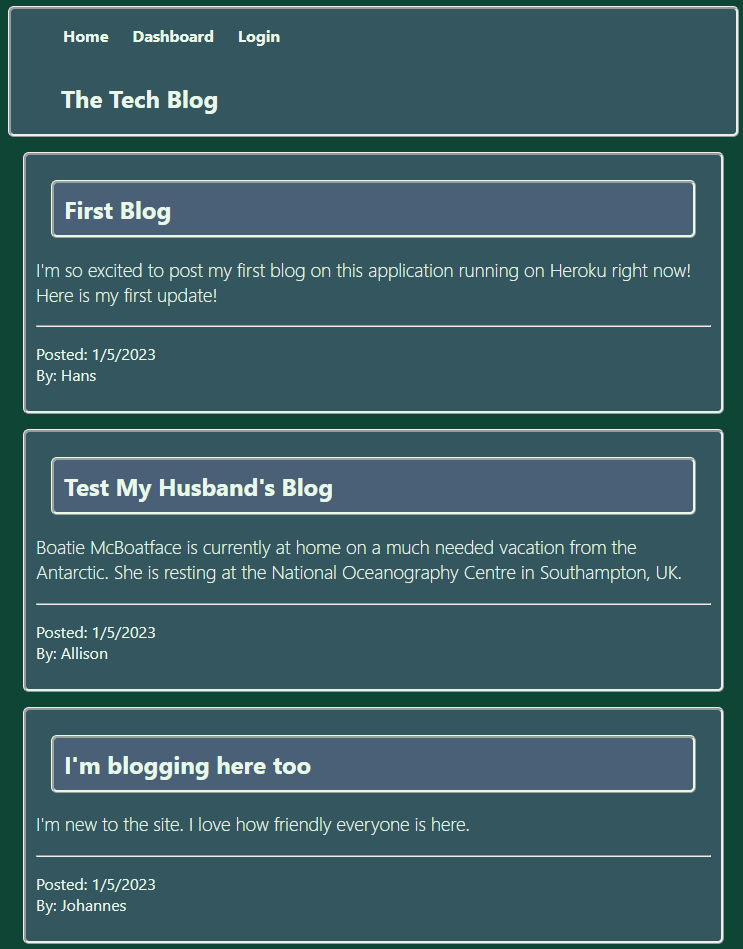

# Blog Application

## Description

This application uses models to create users, blogs and comments. It saves them to a database and records the user's data in a cookie, so that the user must be logged in to make comments or view the details about the blogs. It has been deployed at [eljay-blog-app-01.herokuapp.com.](https://eljay-blog-app-01.herokuapp.com/)

## Table of Contents

- [Video](https://watch.screencastify.com/v/yKTPpJewucD91INLQOR5)
- [Screenshot](#Screenshot)
- [Installation](#installation)
- [Usage](#usage)
- [Credits](#credits)
- [MIT license License](#license)

  

## Link to Video

[Video](https://watch.screencastify.com/v/yKTPpJewucD91INLQOR5)

## Screenshot

## Installation

No installation necessary, this application runs in the browser. Just go to the link: https://eljay-blog-app-01.herokuapp.com/.

## Usage

Create a new user name and password and start commenting, or blogging.

## Questions

If you have any questions about this application send me an email or message on github.

My email address is: [lelandoj@gmail.com](mailto:lelandoj@gmail.com)

My repo URL is: [https://github.com/eljayman/14-mvc-blog-app](https://github.com/eljayman/14-mvc-blog-app)

## How to Contribute

If you would like to contribute to this project. Please send me a message on github.

## Tests

If you find any errors with this application, please send me a message on github.

## Credits

This application was made in [node.js](https://nodejs.org/) and uses [express.js](https://expressjs.com/) as a server with [express-handlebars](https://www.npmjs.com/package/express-handlebars) for rendering and [express-session](https://www.npmjs.com/package/express-session) for handling the cookie (never eat raw cookies,) [bcrypt](https://www.npmjs.com/package/bcrypt) to encrypt passwords, [dotenv](https://www.npmjs.com/package/dotenv) for environment variable storage, [Sequelize](https://sequelize.org/) for ORM, [mysql](https://www.mysql.com/), [mysql2](https://www.npmjs.com/package/mysql2) and [jawsDB](https://www.jawsdb.com/) for database services.

## License

    Copyright 2022 eljayman

Permission is hereby granted, free of charge, to any person obtaining a copy of this software and associated documentation files (the "Software"), to deal in the Software without restriction, including without limitation the rights to use, copy, modify, merge, publish, distribute, sublicense, and/or sell copies of the Software, and to permit persons to whom the Software is furnished to do so, subject to the following conditions:

The above copyright notice and this permission notice shall be included in all copies or substantial portions of the Software.

THE SOFTWARE IS PROVIDED "AS IS", WITHOUT WARRANTY OF ANY KIND, EXPRESS OR IMPLIED, INCLUDING BUT NOT LIMITED TO THE WARRANTIES OF MERCHANTABILITY, FITNESS FOR A PARTICULAR PURPOSE AND NONINFRINGEMENT. IN NO EVENT SHALL THE AUTHORS OR COPYRIGHT HOLDERS BE LIABLE FOR ANY CLAIM, DAMAGES OR OTHER LIABILITY, WHETHER IN AN ACTION OF CONTRACT, TORT OR OTHERWISE, ARISING FROM, OUT OF OR IN CONNECTION WITH THE SOFTWARE OR THE USE OR OTHER DEALINGS IN THE SOFTWARE.
